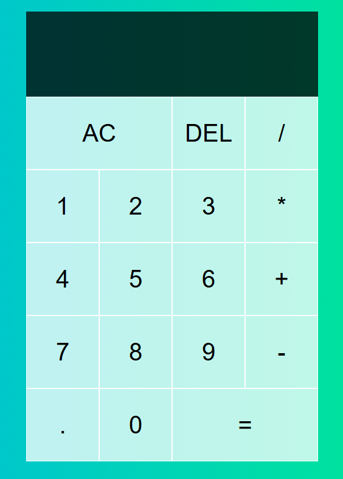

# 🔢 React Calculator

A lightweight calculator web app built using **React**, **Vanilla CSS**, and the **useReducer** hook for state management. It performs basic arithmetic operations (addition, subtraction, multiplication, division) and has a simple, responsive UI. The app was scaffolded using **Vite** for a super fast development experience and is deployed on **Vercel**.

## 🚀 Live Demo

👉 [Check it out here](https://react-calculator-tan-gamma.vercel.app/)  
_(Replace the link above with your actual deployed URL)_

---

## 🛠️ Tech Stack

- **React**
- **Vanilla CSS**
- **useReducer** for state management
- **Vite** for project setup & dev environment
- **Vercel** for deployment

---

## 📂 Project Structure

```
react-calculator/
├── public/
├── src/
│   ├── components/
│   │   └── DigitButtons.jsx
│   │   └── OperButtons.jsx
│   ├── App.css
│   ├── App.jsx
│   ├── index.css
│   └── main.jsx
├── .gitignore
├── README.md
├── eslint.config.js
├── index.html
├── package.json
└── vite.config.js
```

---

## 🧠 Why useReducer?

Instead of the more commonly used `useState`, this project utilizes `useReducer` to handle complex state transitions in a more organized way, especially useful when dealing with operations like:

- Updating display
- Handling operator precedence
- Managing multiple states like previous/next values, operators, and edge cases (e.g. multiple decimals)

---

## 🖥️ Features

- Basic arithmetic: `+`, `-`, `×`, `÷`
- Clear (`AC`) and backspace (`DEL`) functionality
- Handles decimal operations
- Prevents invalid inputs (e.g. multiple decimals, leading zeros)
- Responsive & minimal UI

---

## 📦 Getting Started

Follow these steps to run the project locally:

### 1. Clone the Repository

```bash
git clone https://github.com/yourusername/react-calculator.git
cd react-calculator
```

### 2. Install Dependencies

```bash
npm install
```

### 3. Start Development Server

```bash
npm run dev
```

This will run the app on `http://localhost:5173` by default.

---

## 🧾 Scripts

| Command         | Description                  |
|----------------|------------------------------|
| `npm run dev`   | Run dev server via Vite       |
| `npm run build` | Build for production          |
| `npm run preview` | Preview production build locally |

---

## 🧑‍💻 Author

Made with ❤️ by [Sparsh Vardhan](https://github.com/Sparsh-V3)  
Deployed with ⚡ on [Vercel](https://vercel.com/)

---

## 📸 Screenshot

> 

---

## 📌 Todo / Improvements

- Add keyboard support
- Dark/light mode toggle
- Add scientific calculator features
